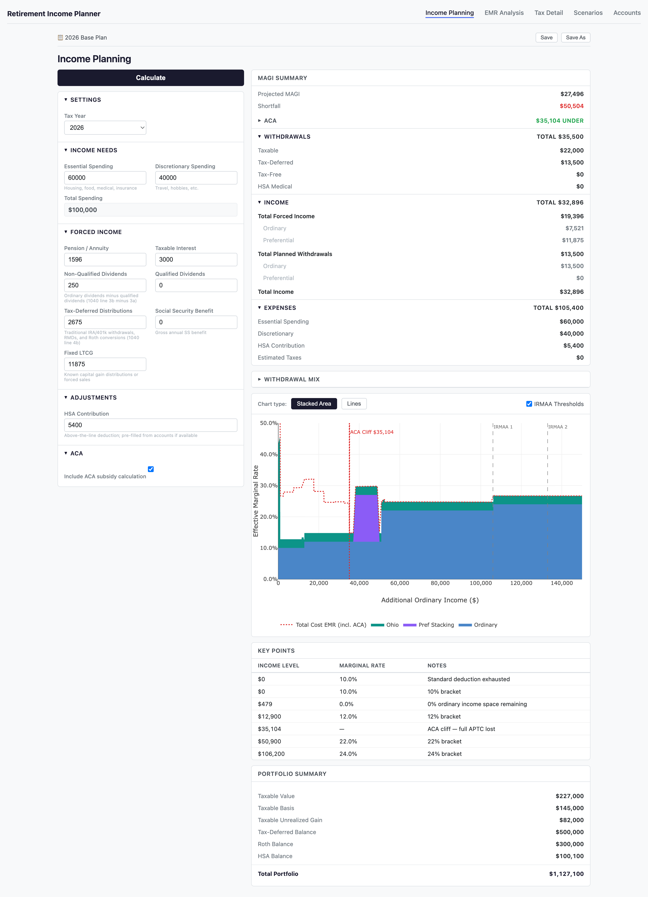
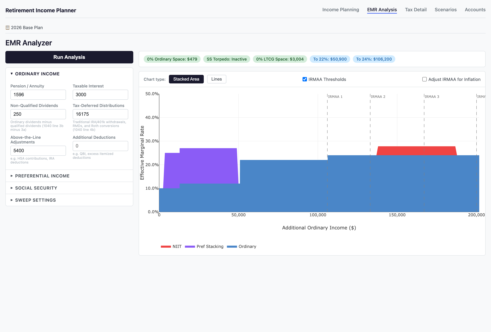

# Retirement Income Planner

A local retirement income planning tool for analyzing expenses, pension, annuity
and Social Security income, portfolio withdrawals, and resulting taxes. Runs
entirely on your machine — no cloud, no accounts, no data leaves your computer.

---

## Disclaimers

- This tool is intended for **educational and entertainment purposes only**. It
  is not tax advice. Consult a qualified tax professional before making financial
  decisions.
- Federal tax calculations are basic and work for a straightforward retirement 
  income profile. More complex situations (AMT, business income, etc.)
  are not supported.
- Ohio state tax calculations are included but Ohio's tax rules are unusual —
  results may not be accurate for all situations.
- ACA subsidy values are highly individual. To use the ACA feature, update
  `data/aca/aca_{year}.json` with your specific healthcare.gov APTC estimates.

---

## Features

- **Income Planning** — analyze spending targets, income sources, and portfolio
  withdrawals with a full Tax Map visualization showing marginal rate interactions
- **EMR Analysis** — detailed effective marginal rate sweep across an income range,
  showing bracket structure, SS torpedo, preferential stacking, NIIT, and IRMAA
- **Tax Detail** — point-in-time federal and Ohio tax breakdown
- **Scenarios** — save, load, export, and import named planning strategies
- **Accounts** — manage portfolio accounts and balances used for withdrawal planning
- **ACA subsidy modeling** — schedule-based interpolation with cliff detection
- **Configurable tax data** — bracket files in `data/` can be updated for new tax
  years without code changes
- Federal tax: 2025 and 2026 brackets, ordinary and preferential income stacking
- Ohio state tax: 2025 and 2026 rates, personal exemption, retirement income credit
- Social Security taxability: torpedo calculation across both tiers
- IRMAA reference thresholds displayed on EMR chart



---

## Requirements

- Python 3.12 or higher
- pip

---

## Setup

```bash
# Clone the repository
git clone https://github.com/rdsteele/retirement-income-planner.git
cd retirement-income-planner

# Create and activate a virtual environment
python3 -m venv .venv
source .venv/bin/activate        # macOS / Linux
.venv\Scripts\activate           # Windows

# Install dependencies
pip install -r requirements.txt
```

---

## Running

```bash
uvicorn api.main:app --reload
```

Open your browser to [http://localhost:8000](http://localhost:8000) — this loads
the Income Planning page.

---

## Pages

| Page | URL | Description |
|---|---|---|
| Income Planning | `/` | Main planning page — spending, income, withdrawals, Tax Map |
| EMR Analysis | `/emr` | Detailed effective marginal rate sweep chart |



| Tax Detail | `/tax` | Point-in-time federal and Ohio tax breakdown |
| Scenarios | `/scenarios` | Save, load, export, and import named scenarios |
| Accounts | `/accounts` | Manage portfolio accounts and balances |

---

## Workflow

### 1. Set Up Accounts
Go to the **Accounts** page and enter your portfolio accounts and current balances.
These are used to support withdrawal planning on the Income Planning page.

### 2. Load or Start a Scenario
Go to the **Scenarios** page to load a previously saved scenario, or go directly
to the **Income Planning** page to start fresh.

### 3. Plan Income and Withdrawals on the Income Planning Page

1. Select tax year
2. Enter essential and discretionary spending targets
3. Enter known, expected, or estimated "forced" income (pension, Social Security,
   RMDs, interest, dividends)
4. Enter HSA contribution, if any
5. Check **Include ACA** to model ACA subsidy interactions
6. Click **Calculate**

Review the **MAGI Summary** to see income and expense totals. Review the **Tax Map**
chart to see income interactions and associated costs (taxes and ACA subsidy loss).

### 4. Optimize Withdrawals

- Check whether standard deduction space has been filled with ordinary income —
  if space remains, consider filling with IRA withdrawals or Roth conversions
- Check whether the 0% preferential income bracket has been filled — if space
  remains, consider LTCG harvesting
- Review **Accounts** and enter withdrawal amounts
- Review the MAGI Summary and Tax Map after each change to evaluate effects on
  effective marginal rate and ACA strategy
- Roth conversion amounts can also be analyzed — useful in conjunction with
  strategic retirement planning software to model future bracket exposure

### 5. Save the Scenario
Once satisfied with a strategy, save it from the Income Planning page for future
review and comparison.

### 6. Supporting Analysis
Navigate to the **EMR Analysis** or **Tax Detail** pages at any time for deeper
analysis of a specific income level or tax component.

---

## ACA Configuration

ACA subsidy values are individual — they depend on your age, zip code, plan, and
the specific APTC estimates from healthcare.gov for your coverage year.

To use ACA modeling:
1. Get APTC estimates at several MAGI levels from healthcare.gov
2. Update `data/aca/aca_{year}.json` with your schedule points
3. The service interpolates between points and detects the 400% FPL cliff

See the schedule format in `data/aca/aca_2026.json` for reference.

---

## Personal Data

Scenario and account data lives in the `profile/` directory, which is excluded
from version control so your financial data stays private.

- `profile/accounts.json` — your account balances and holdings
- `profile/scenarios/` — your saved planning scenarios

See `profile/README.md` for the accounts.json format and a minimal example.

---

## Project Structure

```
api/              # FastAPI application
  routers/        # API route handlers
  models/         # Pydantic request/response models
  static/         # Frontend HTML/JS and Plotly
data/             # Tax bracket and threshold data (JSON)
  brackets/       # Federal and Ohio bracket files by year
  aca/            # ACA schedule data by year
profile/          # Personal financial data (not in version control)
  accounts.json   # Your account balances and holdings
  scenarios/      # Your saved planning scenarios
  README.md       # Format guide and example
services/         # Tax and planning calculation services
specs/            # Design specifications
tests/            # Unit, functional, and scenario tests
```

---

## Development

```bash
# Run tests
pytest

# Run tests with coverage
pytest --cov=services --cov=api --cov-report=term-missing

# Lint
ruff check .

# Type check
mypy .
```

The CI pipeline (GitHub Actions) runs ruff, mypy, pytest, bandit, and
pip-audit on every push to main.

---

## Tax Year Support

| Tax Year | Federal | Ohio |
|---|---|---|
| 2025 | ✅ | ✅ |
| 2026 | ✅ | ✅ |
